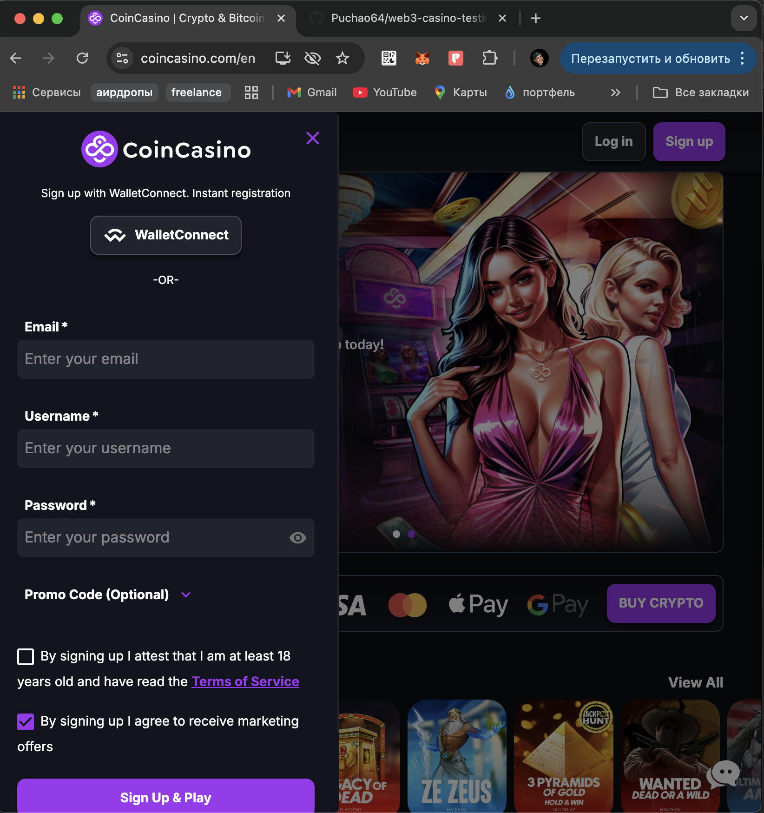
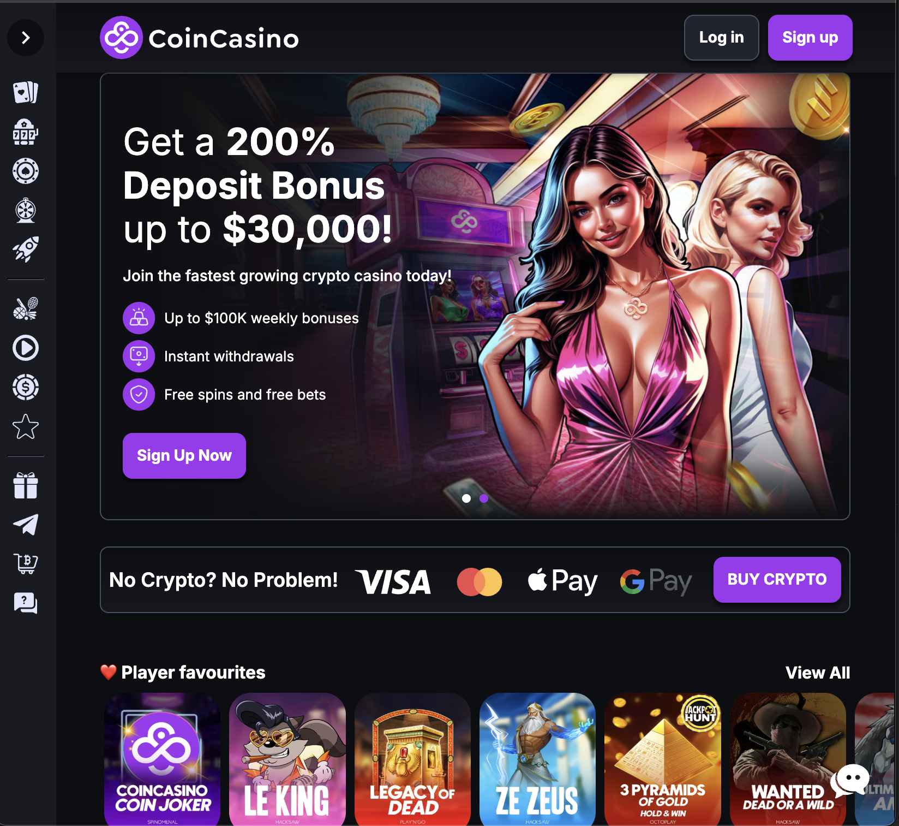
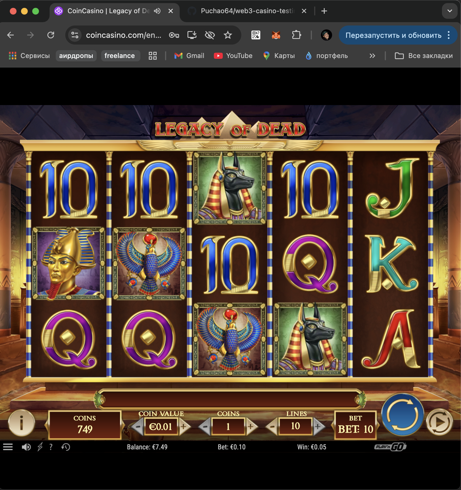
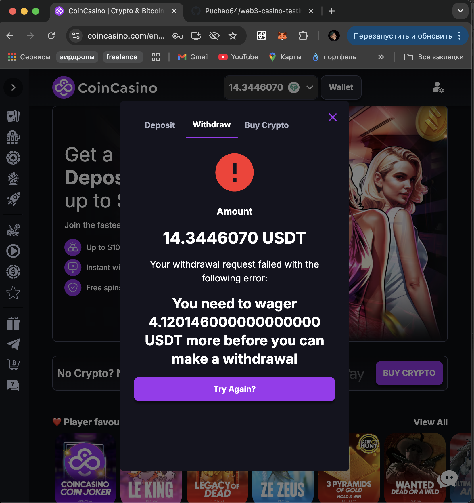

# web3-casino-testing

Testing session for a Web3 casino (CoinCasino): UI, usability, basic gameplay flow, and balance update issues. No-code/manual QA exploration.

---

### ❌ Step 1 — Wallet Login Flow Bug

- **Action:** Clicked “WalletConnect” → Chose MetaMask → Connected wallet  
- **Result:** After connection initiated, the site still asked for email, username, and password  
- **Expected:** Wallet login should bypass manual registration  
- **Screenshot:**  
  

---

### ✅ Step 2 — UI & Landing Page Check

- **Action:** Visited homepage of CoinCasino  
- **Result:** Landing page loaded with expected layout  
- **Screenshot:**  
  

---

### ✅ Step 3 — Gameplay and Withdrawal Attempt

- **Action:** Played slots (Legacy of Dead), made 1–2 spins  
- **Result:** Game responded correctly, spin executed, winnings updated  
- **Screenshot:**  
  

- **Additional Test:** Tried to withdraw funds after game session  
- **Result:** System blocked withdrawal due to wager requirement  
- **Screenshot:**  
  
